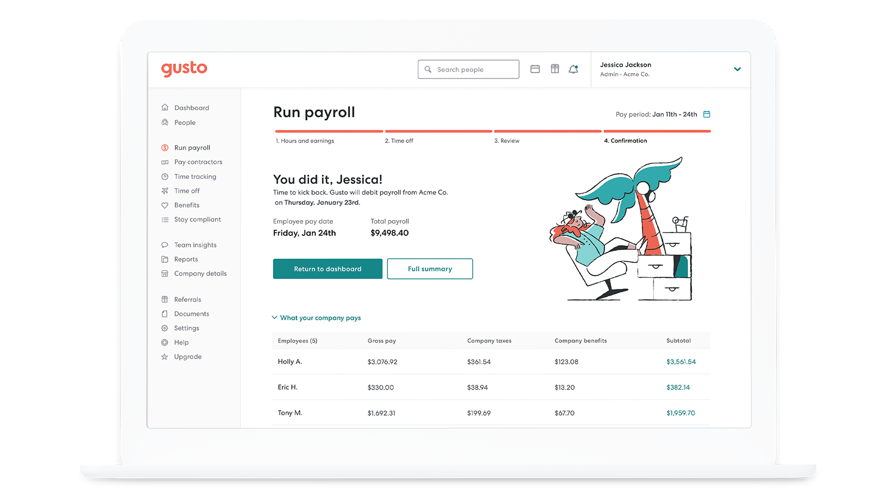

<div align="center">

[](https://gusto.com)

# [Gusto](https://gusto.com)

Welcome to Gusto's Embedded Payroll API documentation!

</div>

## Requirements

Building the API client library requires:

1. Java 1.8+
2. Maven (3.8.3+)/Gradle (7.2+)

If you are adding this library to an Android Application or Library:

3. Android 8.0+ (API Level 26+)

## Installation<a id="installation"></a>
<div align="center">
  <a href="https://konfigthis.com/sdk-sign-up?company=Gusto&serviceName=Embedded%20Payroll&language=Java">
    
  </a>
</div>

### Maven users

Add this dependency to your project's POM:

```xml
<dependency>
  <groupId>com.konfigthis</groupId>
  <artifactId>gusto-embedded-payroll-java-sdk</artifactId>
  <version>2024-03-01</version>
  <scope>compile</scope>
</dependency>
```

### Gradle users

Add this dependency to your `build.gradle`:

```groovy
// build.gradle
repositories {
  mavenCentral()
}

dependencies {
   implementation "com.konfigthis:gusto-embedded-payroll-java-sdk:2024-03-01"
}
```

### Android users

Make sure your `build.gradle` file as a `minSdk` version of at least 26:
```groovy
// build.gradle
android {
    defaultConfig {
        minSdk 26
    }
}
```

Also make sure your library or application has internet permissions in your `AndroidManifest.xml`:

```xml
<!--AndroidManifest.xml-->
<?xml version="1.0" encoding="utf-8"?>
<manifest xmlns:android="http://schemas.android.com/apk/res/android"
    xmlns:tools="http://schemas.android.com/tools">
    <uses-permission android:name="android.permission.INTERNET"/>
</manifest>
```

### Others

At first generate the JAR by executing:

```shell
mvn clean package
```

Then manually install the following JARs:

* `target/gusto-embedded-payroll-java-sdk-2024-03-01.jar`
* `target/lib/*.jar`

## Getting Started

Please follow the [installation](#installation) instruction and execute the following Java code:

```java
import com.konfigthis.client.ApiClient;
import com.konfigthis.client.ApiException;
import com.konfigthis.client.ApiResponse;
import com.konfigthis.client.GustoEmbeddedPayroll;
import com.konfigthis.client.Configuration;
import com.konfigthis.client.auth.*;
import com.konfigthis.client.model.*;
import com.konfigthis.client.api.AchTransactionsApi;
import java.util.List;
import java.util.Map;
import java.util.UUID;

public class Example {
  public static void main(String[] args) {
    Configuration configuration = new Configuration();
    configuration.host = "https://api.gusto-demo.com";
    
    // Configure HTTP bearer authorization: Authorization
    configuration.token = "BEARER TOKEN";
    GustoEmbeddedPayroll client = new GustoEmbeddedPayroll(configuration);
    String companyUuid = "companyUuid_example"; // The UUID of the company
    String contractorPaymentUuid = "contractorPaymentUuid_example"; // The UUID of the contractor payment
    String payrollUuid = "payrollUuid_example"; // The UUID of the payroll
    String transactionType = "transactionType_example"; // Used to filter the ACH transactions to only include those with a specific transaction type, such as \"Credit employee pay\".
    String paymentDirection = "paymentDirection_example"; // Used to filter the ACH transactions to only include those with a specific payment direction, either \"credit\" or \"debit\".
    String xGustoAPIVersion = "2024-03-01"; // Determines the date-based API version associated with your API call. If none is provided, your application's [minimum API version](https://docs.gusto.com/embedded-payroll/docs/api-versioning#minimum-api-version) is used.
    try {
      List<AchTransaction> result = client
              .achTransactions
              .getAllForCompany(companyUuid)
              .contractorPaymentUuid(contractorPaymentUuid)
              .payrollUuid(payrollUuid)
              .transactionType(transactionType)
              .paymentDirection(paymentDirection)
              .xGustoAPIVersion(xGustoAPIVersion)
              .execute();
      System.out.println(result);
    } catch (ApiException e) {
      System.err.println("Exception when calling AchTransactionsApi#getAllForCompany");
      System.err.println("Status code: " + e.getStatusCode());
      System.err.println("Reason: " + e.getResponseBody());
      System.err.println("Response headers: " + e.getResponseHeaders());
      e.printStackTrace();
    }

    // Use .executeWithHttpInfo() to retrieve HTTP Status Code, Headers and Request
    try {
      ApiResponse<List<AchTransaction>> response = client
              .achTransactions
              .getAllForCompany(companyUuid)
              .contractorPaymentUuid(contractorPaymentUuid)
              .payrollUuid(payrollUuid)
              .transactionType(transactionType)
              .paymentDirection(paymentDirection)
              .xGustoAPIVersion(xGustoAPIVersion)
              .executeWithHttpInfo();
      System.out.println(response.getResponseBody());
      System.out.println(response.getResponseHeaders());
      System.out.println(response.getStatusCode());
      System.out.println(response.getRoundTripTime());
      System.out.println(response.getRequest());
    } catch (ApiException e) {
      System.err.println("Exception when calling AchTransactionsApi#getAllForCompany");
      System.err.println("Status code: " + e.getStatusCode());
      System.err.println("Reason: " + e.getResponseBody());
      System.err.println("Response headers: " + e.getResponseHeaders());
      e.printStackTrace();
    }
  }
}

```

## Documentation for API Endpoints

All URIs are relative to *https://api.gusto-demo.com*

Class | Method | HTTP request | Description
------------ | ------------- | ------------- | -------------
*AchTransactionsApi* | [**getAllForCompany**](docs/AchTransactionsApi.md#getAllForCompany) | **GET** /v1/companies/{company_uuid}/ach_transactions | Get all ACH transactions for a company
*BankAccountsApi* | [**createFromPlaidToken**](docs/BankAccountsApi.md#createFromPlaidToken) | **POST** /v1/plaid/processor_token | Create a bank account from a plaid processor token
*BankAccountsApi* | [**createVerificationDeposits**](docs/BankAccountsApi.md#createVerificationDeposits) | **POST** /v1/companies/{company_id}/bank_accounts | Create a company bank account
*BankAccountsApi* | [**listCompanyBankAccounts**](docs/BankAccountsApi.md#listCompanyBankAccounts) | **GET** /v1/companies/{company_id}/bank_accounts | Get all company bank accounts
*BankAccountsApi* | [**verifyMicroDeposits**](docs/BankAccountsApi.md#verifyMicroDeposits) | **PUT** /v1/companies/{company_id}/bank_accounts/{bank_account_uuid}/verify | Verify a company bank account
*CompaniesApi* | [**acceptTermsOfService**](docs/CompaniesApi.md#acceptTermsOfService) | **POST** /v1/partner_managed_companies/{company_uuid}/accept_terms_of_service | Accept terms of service for a company user
*CompaniesApi* | [**createAdmin**](docs/CompaniesApi.md#createAdmin) | **POST** /v1/companies/{company_id}/admins | Create an admin for the company
*CompaniesApi* | [**createPartnerManagedCompany**](docs/CompaniesApi.md#createPartnerManagedCompany) | **POST** /v1/partner_managed_companies | Create a partner managed company
*CompaniesApi* | [**finishOnboarding**](docs/CompaniesApi.md#finishOnboarding) | **PUT** /v1/companies/{company_uuid}/finish_onboarding | Finish company onboarding
*CompaniesApi* | [**getAllAdmins**](docs/CompaniesApi.md#getAllAdmins) | **GET** /v1/companies/{company_id}/admins | Get all the admins at a company
*CompaniesApi* | [**getCompany**](docs/CompaniesApi.md#getCompany) | **GET** /v1/companies/{company_id} | Get a company
*CompaniesApi* | [**getCustomFields**](docs/CompaniesApi.md#getCustomFields) | **GET** /v1/companies/{company_id}/custom_fields | Get the custom fields of a company
*CompaniesApi* | [**getOnboardingStatus**](docs/CompaniesApi.md#getOnboardingStatus) | **GET** /v1/companies/{company_uuid}/onboarding_status | Get the company&#39;s onboarding status
*CompaniesApi* | [**getTermsOfServiceStatus**](docs/CompaniesApi.md#getTermsOfServiceStatus) | **POST** /v1/partner_managed_companies/{company_uuid}/retrieve_terms_of_service | Retrieve terms of service status for a company user
*CompaniesApi* | [**migrateToEmbeddedPayroll**](docs/CompaniesApi.md#migrateToEmbeddedPayroll) | **PUT** /v1/partner_managed_companies/{company_uuid}/migrate | Migrate company to embedded payroll
*CompanyBenefitsApi* | [**createBenefit**](docs/CompanyBenefitsApi.md#createBenefit) | **POST** /v1/companies/{company_id}/company_benefits | Create a company benefit
*CompanyBenefitsApi* | [**deleteBenefit**](docs/CompanyBenefitsApi.md#deleteBenefit) | **DELETE** /v1/company_benefits/{company_benefit_id} | Delete a company benefit
*CompanyBenefitsApi* | [**getBenefitById**](docs/CompanyBenefitsApi.md#getBenefitById) | **GET** /v1/company_benefits/{company_benefit_id} | Get a company benefit
*CompanyBenefitsApi* | [**getBenefitFieldsRequirementsById**](docs/CompanyBenefitsApi.md#getBenefitFieldsRequirementsById) | **GET** /v1/benefits/{benefit_id}/requirements | Get benefit fields requirements by ID
*CompanyBenefitsApi* | [**getBenefitSummaryById**](docs/CompanyBenefitsApi.md#getBenefitSummaryById) | **GET** /v1/company_benefits/{company_benefit_id}/summary | Get company benefit summary by company benefit id.
*CompanyBenefitsApi* | [**getBenefitsForCompany**](docs/CompanyBenefitsApi.md#getBenefitsForCompany) | **GET** /v1/companies/{company_id}/company_benefits | Get benefits for a company
*CompanyBenefitsApi* | [**getSupportedBenefitById**](docs/CompanyBenefitsApi.md#getSupportedBenefitById) | **GET** /v1/benefits/{benefit_id} | Get a supported benefit by ID
*CompanyBenefitsApi* | [**listSupportedBenefits**](docs/CompanyBenefitsApi.md#listSupportedBenefits) | **GET** /v1/benefits | Get all benefits supported by Gusto
*CompanyBenefitsApi* | [**updateBenefit**](docs/CompanyBenefitsApi.md#updateBenefit) | **PUT** /v1/company_benefits/{company_benefit_id} | Update a company benefit
*CompanyFormsApi* | [**getAllForms**](docs/CompanyFormsApi.md#getAllForms) | **GET** /v1/companies/{company_id}/forms | Get all company forms
*CompanyFormsApi* | [**getFormById**](docs/CompanyFormsApi.md#getFormById) | **GET** /v1/forms/{form_id} | Get a company form
*CompanyFormsApi* | [**getPdfLink**](docs/CompanyFormsApi.md#getPdfLink) | **GET** /v1/forms/{form_id}/pdf | Get a company form pdf
*CompanyFormsApi* | [**signForm**](docs/CompanyFormsApi.md#signForm) | **PUT** /v1/forms/{form_id}/sign | Sign a company form
*ContractorFormsApi* | [**create1099Form**](docs/ContractorFormsApi.md#create1099Form) | **POST** /v1/sandbox/generate_1099 | Generate a 1099 form [DEMO]
*ContractorFormsApi* | [**getByIdForm**](docs/ContractorFormsApi.md#getByIdForm) | **GET** /v1/contractors/{contractor_uuid}/forms/{form_id} | Get a contractor form
*ContractorFormsApi* | [**getPdfLink**](docs/ContractorFormsApi.md#getPdfLink) | **GET** /v1/contractors/{contractor_uuid}/forms/{form_id}/pdf | Get the contractor form pdf
*ContractorFormsApi* | [**listAll**](docs/ContractorFormsApi.md#listAll) | **GET** /v1/contractors/{contractor_uuid}/forms | Get all contractor forms
*ContractorPaymentMethodApi* | [**createBankAccount**](docs/ContractorPaymentMethodApi.md#createBankAccount) | **POST** /v1/contractors/{contractor_uuid}/bank_accounts | Create an contractor bank account
*ContractorPaymentMethodApi* | [**getContractorPaymentMethod**](docs/ContractorPaymentMethodApi.md#getContractorPaymentMethod) | **GET** /v1/contractors/{contractor_uuid}/payment_method | Get a contractor&#39;s payment method
*ContractorPaymentMethodApi* | [**listBankAccounts**](docs/ContractorPaymentMethodApi.md#listBankAccounts) | **GET** /v1/contractors/{contractor_uuid}/bank_accounts | Get all contractor bank accounts
*ContractorPaymentMethodApi* | [**updateBankAccount**](docs/ContractorPaymentMethodApi.md#updateBankAccount) | **PUT** /v1/contractors/{contractor_uuid}/payment_method | Update a contractor&#39;s payment method
*ContractorPaymentsApi* | [**cancelPayment**](docs/ContractorPaymentsApi.md#cancelPayment) | **DELETE** /v1/companies/{company_id}/contractor_payments/{contractor_payment_id} | Cancel a contractor payment
*ContractorPaymentsApi* | [**createPayment**](docs/ContractorPaymentsApi.md#createPayment) | **POST** /v1/companies/{company_id}/contractor_payments | Create a contractor payment
*ContractorPaymentsApi* | [**fundContractorPayment**](docs/ContractorPaymentsApi.md#fundContractorPayment) | **PUT** /v1/contractor_payments/{contractor_payment_uuid}/fund | Fund a contractor payment [DEMO]
*ContractorPaymentsApi* | [**getSinglePayment**](docs/ContractorPaymentsApi.md#getSinglePayment) | **GET** /v1/companies/{company_id}/contractor_payments/{contractor_payment_id} | Get a single contractor payment
*ContractorPaymentsApi* | [**getSingleReceipt**](docs/ContractorPaymentsApi.md#getSingleReceipt) | **GET** /v1/contractor_payments/{contractor_payment_uuid}/receipt | Get a single contractor payment receipt
*ContractorPaymentsApi* | [**getWithinTimePeriodTotals**](docs/ContractorPaymentsApi.md#getWithinTimePeriodTotals) | **GET** /v1/companies/{company_id}/contractor_payments | Get contractor payments for a company
*ContractorPaymentsApi* | [**previewDebitDate**](docs/ContractorPaymentsApi.md#previewDebitDate) | **GET** /v1/companies/{company_uuid}/contractor_payments/preview | Preview contractor payment debit date
*ContractorsApi* | [**changeOnboardingStatus**](docs/ContractorsApi.md#changeOnboardingStatus) | **PUT** /v1/contractors/{contractor_uuid}/onboarding_status | Change the contractor&#39;s onboarding status
*ContractorsApi* | [**createNewContractor**](docs/ContractorsApi.md#createNewContractor) | **POST** /v1/companies/{company_id}/contractors | Create a contractor
*ContractorsApi* | [**deleteContractor**](docs/ContractorsApi.md#deleteContractor) | **DELETE** /v1/contractors/{contractor_id} | Delete a contractor
*ContractorsApi* | [**getAddress**](docs/ContractorsApi.md#getAddress) | **GET** /v1/contractors/{contractor_uuid}/address | Get a contractor address
*ContractorsApi* | [**getById**](docs/ContractorsApi.md#getById) | **GET** /v1/contractors/{contractor_id} | Get a contractor
*ContractorsApi* | [**getCompanyContractors**](docs/ContractorsApi.md#getCompanyContractors) | **GET** /v1/companies/{company_id}/contractors | Get contractors of a company
*ContractorsApi* | [**getOnboardingStatus**](docs/ContractorsApi.md#getOnboardingStatus) | **GET** /v1/contractors/{contractor_uuid}/onboarding_status | Get the contractor&#39;s onboarding status
*ContractorsApi* | [**updateAddress**](docs/ContractorsApi.md#updateAddress) | **PUT** /v1/contractors/{contractor_uuid}/address | Update a contractor&#39;s address
*ContractorsApi* | [**updateContractor**](docs/ContractorsApi.md#updateContractor) | **PUT** /v1/contractors/{contractor_id} | Update a contractor
*DepartmentsApi* | [**addPeopleToDepartment**](docs/DepartmentsApi.md#addPeopleToDepartment) | **PUT** /v1/departments/{department_uuid}/add | Add people to a department
*DepartmentsApi* | [**createDepartment**](docs/DepartmentsApi.md#createDepartment) | **POST** /v1/companies/{company_uuid}/departments | Create a department
*DepartmentsApi* | [**deleteDepartment**](docs/DepartmentsApi.md#deleteDepartment) | **DELETE** /v1/departments/{department_uuid} | Delete a department
*DepartmentsApi* | [**getAllWithEmployees**](docs/DepartmentsApi.md#getAllWithEmployees) | **GET** /v1/companies/{company_uuid}/departments | Get all departments of a company
*DepartmentsApi* | [**getDepartmentByUuid**](docs/DepartmentsApi.md#getDepartmentByUuid) | **GET** /v1/departments/{department_uuid} | Get a department
*DepartmentsApi* | [**removePeopleFromDepartment**](docs/DepartmentsApi.md#removePeopleFromDepartment) | **PUT** /v1/departments/{department_uuid}/remove | Remove people from a department
*DepartmentsApi* | [**updateDepartment**](docs/DepartmentsApi.md#updateDepartment) | **PUT** /v1/departments/{department_uuid} | Update a department
*EarningTypesApi* | [**createCustomEarningType**](docs/EarningTypesApi.md#createCustomEarningType) | **POST** /v1/companies/{company_id}/earning_types | Create a custom earning type
*EarningTypesApi* | [**deactivateType**](docs/EarningTypesApi.md#deactivateType) | **DELETE** /v1/companies/{company_id}/earning_types/{earning_type_uuid} | Deactivate an earning type
*EarningTypesApi* | [**getAll**](docs/EarningTypesApi.md#getAll) | **GET** /v1/companies/{company_id}/earning_types | Get all earning types for a company
*EarningTypesApi* | [**updateType**](docs/EarningTypesApi.md#updateType) | **PUT** /v1/companies/{company_id}/earning_types/{earning_type_uuid} | Update an earning type
*EmployeeAddressesApi* | [**createHomeAddress**](docs/EmployeeAddressesApi.md#createHomeAddress) | **POST** /v1/employees/{employee_id}/home_addresses | Create an employee&#39;s home address
*EmployeeAddressesApi* | [**createWorkAddress**](docs/EmployeeAddressesApi.md#createWorkAddress) | **POST** /v1/employees/{employee_id}/work_addresses | Create an employee work address
*EmployeeAddressesApi* | [**deleteHome**](docs/EmployeeAddressesApi.md#deleteHome) | **DELETE** /v1/home_addresses/{home_address_uuid} | Delete an employee&#39;s home address
*EmployeeAddressesApi* | [**deleteWorkAddress**](docs/EmployeeAddressesApi.md#deleteWorkAddress) | **DELETE** /v1/work_addresses/{work_address_uuid} | Delete an employee&#39;s work address
*EmployeeAddressesApi* | [**getHomeAddress**](docs/EmployeeAddressesApi.md#getHomeAddress) | **GET** /v1/home_addresses/{home_address_uuid} | Get an employee&#39;s home address
*EmployeeAddressesApi* | [**getHomeAddresses**](docs/EmployeeAddressesApi.md#getHomeAddresses) | **GET** /v1/employees/{employee_id}/home_addresses | Get an employee&#39;s home addresses
*EmployeeAddressesApi* | [**getWorkAddress**](docs/EmployeeAddressesApi.md#getWorkAddress) | **GET** /v1/work_addresses/{work_address_uuid} | Get an employee work address
*EmployeeAddressesApi* | [**listWorkAddresses**](docs/EmployeeAddressesApi.md#listWorkAddresses) | **GET** /v1/employees/{employee_id}/work_addresses | Get an employee&#39;s work addresses
*EmployeeAddressesApi* | [**updateHomeAddress**](docs/EmployeeAddressesApi.md#updateHomeAddress) | **PUT** /v1/home_addresses/{home_address_uuid} | Update an employee&#39;s home address
*EmployeeAddressesApi* | [**updateWorkAddress**](docs/EmployeeAddressesApi.md#updateWorkAddress) | **PUT** /v1/work_addresses/{work_address_uuid} | Update an employee work address
*EmployeeBenefitsApi* | [**createBenefitRecord**](docs/EmployeeBenefitsApi.md#createBenefitRecord) | **POST** /v1/employees/{employee_id}/employee_benefits | Create an employee benefit
*EmployeeBenefitsApi* | [**createYtdBenefitAmountsFromDifferentCompany**](docs/EmployeeBenefitsApi.md#createYtdBenefitAmountsFromDifferentCompany) | **POST** /v1/employees/{employee_id}/ytd_benefit_amounts_from_different_company | Create year-to-date benefit amounts from a different company
*EmployeeBenefitsApi* | [**deleteById**](docs/EmployeeBenefitsApi.md#deleteById) | **DELETE** /v1/employee_benefits/{employee_benefit_id} | Delete an employee benefit
*EmployeeBenefitsApi* | [**getAllForEmployee**](docs/EmployeeBenefitsApi.md#getAllForEmployee) | **GET** /v1/employees/{employee_id}/employee_benefits | Get all benefits for an employee
*EmployeeBenefitsApi* | [**getEmployeeBenefitById**](docs/EmployeeBenefitsApi.md#getEmployeeBenefitById) | **GET** /v1/employee_benefits/{employee_benefit_id} | Get an employee benefit
*EmployeeBenefitsApi* | [**updateBenefitRecord**](docs/EmployeeBenefitsApi.md#updateBenefitRecord) | **PUT** /v1/employee_benefits/{employee_benefit_id} | Update an employee benefit
*EmployeeEmploymentsApi* | [**createRehire**](docs/EmployeeEmploymentsApi.md#createRehire) | **POST** /v1/employees/{employee_id}/rehire | Create an employee rehire
*EmployeeEmploymentsApi* | [**createTermination**](docs/EmployeeEmploymentsApi.md#createTermination) | **POST** /v1/employees/{employee_id}/terminations | Create an employee termination
*EmployeeEmploymentsApi* | [**deleteTermination**](docs/EmployeeEmploymentsApi.md#deleteTermination) | **DELETE** /v1/employees/{employee_id}/terminations | Delete an employee termination
*EmployeeEmploymentsApi* | [**getHistory**](docs/EmployeeEmploymentsApi.md#getHistory) | **GET** /v1/employees/{employee_id}/employment_history | Get employment history for an employee
*EmployeeEmploymentsApi* | [**getRehire**](docs/EmployeeEmploymentsApi.md#getRehire) | **GET** /v1/employees/{employee_id}/rehire | Get an employee rehire
*EmployeeEmploymentsApi* | [**listEmployeeTerminations**](docs/EmployeeEmploymentsApi.md#listEmployeeTerminations) | **GET** /v1/employees/{employee_id}/terminations | Get terminations for an employee
*EmployeeEmploymentsApi* | [**removeRehire**](docs/EmployeeEmploymentsApi.md#removeRehire) | **DELETE** /v1/employees/{employee_id}/rehire | Delete an employee rehire
*EmployeeEmploymentsApi* | [**updateRehire**](docs/EmployeeEmploymentsApi.md#updateRehire) | **PUT** /v1/employees/{employee_id}/rehire | Update an employee rehire
*EmployeeEmploymentsApi* | [**updateTermination**](docs/EmployeeEmploymentsApi.md#updateTermination) | **PUT** /v1/terminations/{employee_id} | Update an employee termination
*EmployeeFormsApi* | [**generateW2Document**](docs/EmployeeFormsApi.md#generateW2Document) | **POST** /v1/sandbox/generate_w2 | Generate a W2 form [DEMO]
*EmployeeFormsApi* | [**getAllEmployeeForms**](docs/EmployeeFormsApi.md#getAllEmployeeForms) | **GET** /v1/employees/{employee_id}/forms | Get all employee forms
*EmployeeFormsApi* | [**getFormById**](docs/EmployeeFormsApi.md#getFormById) | **GET** /v1/employees/{employee_id}/forms/{form_id} | Get an employee form
*EmployeeFormsApi* | [**getPdfLink**](docs/EmployeeFormsApi.md#getPdfLink) | **GET** /v1/employees/{employee_id}/forms/{form_id}/pdf | Get the employee form pdf
*EmployeeFormsApi* | [**signForm**](docs/EmployeeFormsApi.md#signForm) | **PUT** /v1/employees/{employee_id}/forms/{form_id}/sign | Sign an employee form
*EmployeePaymentMethodApi* | [**createBankAccount**](docs/EmployeePaymentMethodApi.md#createBankAccount) | **POST** /v1/employees/{employee_id}/bank_accounts | Create an employee bank account
*EmployeePaymentMethodApi* | [**deleteBankAccount**](docs/EmployeePaymentMethodApi.md#deleteBankAccount) | **DELETE** /v1/employees/{employee_id}/bank_accounts/{bank_account_uuid} | Delete an employee bank account
*EmployeePaymentMethodApi* | [**getBankAccounts**](docs/EmployeePaymentMethodApi.md#getBankAccounts) | **GET** /v1/employees/{employee_id}/payment_method | Get an employee&#39;s payment method
*EmployeePaymentMethodApi* | [**listBankAccounts**](docs/EmployeePaymentMethodApi.md#listBankAccounts) | **GET** /v1/employees/{employee_id}/bank_accounts | Get all employee bank accounts
*EmployeePaymentMethodApi* | [**updatePaymentMethod**](docs/EmployeePaymentMethodApi.md#updatePaymentMethod) | **PUT** /v1/employees/{employee_id}/payment_method | Update an employee&#39;s payment method
*EmployeeTaxSetupApi* | [**getFederalTaxesById**](docs/EmployeeTaxSetupApi.md#getFederalTaxesById) | **GET** /v1/employees/{employee_uuid}/federal_taxes | Get an employee&#39;s federal taxes
*EmployeeTaxSetupApi* | [**getStateTaxes**](docs/EmployeeTaxSetupApi.md#getStateTaxes) | **GET** /v1/employees/{employee_uuid}/state_taxes | Get an employee&#39;s state taxes
*EmployeeTaxSetupApi* | [**updateFederalTaxes**](docs/EmployeeTaxSetupApi.md#updateFederalTaxes) | **PUT** /v1/employees/{employee_uuid}/federal_taxes | Update an employee&#39;s federal taxes
*EmployeeTaxSetupApi* | [**updateStateTaxes**](docs/EmployeeTaxSetupApi.md#updateStateTaxes) | **PUT** /v1/employees/{employee_uuid}/state_taxes | Update an employee&#39;s state taxes
*EmployeesApi* | [**completeOnboarding**](docs/EmployeesApi.md#completeOnboarding) | **PUT** /v1/employees/{employee_id}/finish_onboarding | Finish onboarding an employee
*EmployeesApi* | [**createEmployee**](docs/EmployeesApi.md#createEmployee) | **POST** /v1/companies/{company_id}/employees | Create an employee
*EmployeesApi* | [**deleteOnboardingEmployee**](docs/EmployeesApi.md#deleteOnboardingEmployee) | **DELETE** /v1/employees/{employee_id} | Delete an onboarding employee
*EmployeesApi* | [**getCustomFields**](docs/EmployeesApi.md#getCustomFields) | **GET** /v1/employees/{employee_id}/custom_fields | Get an employee&#39;s custom fields
*EmployeesApi* | [**getEmployeeById**](docs/EmployeesApi.md#getEmployeeById) | **GET** /v1/employees/{employee_id} | Get an employee
*EmployeesApi* | [**getOnboardingStatus**](docs/EmployeesApi.md#getOnboardingStatus) | **GET** /v1/employees/{employee_id}/onboarding_status | Get the employee&#39;s onboarding status
*EmployeesApi* | [**getTimeOffActivities**](docs/EmployeesApi.md#getTimeOffActivities) | **GET** /v1/employees/{employee_uuid}/time_off_activities | Get employee time off activities
*EmployeesApi* | [**listCompanyEmployees**](docs/EmployeesApi.md#listCompanyEmployees) | **GET** /v1/companies/{company_id}/employees | Get employees of a company
*EmployeesApi* | [**updateEmployee**](docs/EmployeesApi.md#updateEmployee) | **PUT** /v1/employees/{employee_id} | Update an employee
*EmployeesApi* | [**updateOnboardingStatus**](docs/EmployeesApi.md#updateOnboardingStatus) | **PUT** /v1/employees/{employee_id}/onboarding_status | Update the employee&#39;s onboarding status
*EventsApi* | [**get30DayEvents**](docs/EventsApi.md#get30DayEvents) | **GET** /v1/events | Get all events
*ExternalPayrollsApi* | [**createNewPayroll**](docs/ExternalPayrollsApi.md#createNewPayroll) | **POST** /v1/companies/{company_uuid}/external_payrolls | Create a new external payroll for a company
*ExternalPayrollsApi* | [**deletePayroll**](docs/ExternalPayrollsApi.md#deletePayroll) | **DELETE** /v1/companies/{company_uuid}/external_payrolls/{external_payroll_id} | Delete an external payroll
*ExternalPayrollsApi* | [**finalizeTaxLiabilities**](docs/ExternalPayrollsApi.md#finalizeTaxLiabilities) | **PUT** /v1/companies/{company_uuid}/external_payrolls/tax_liabilities/finish | Finalize tax liabilities options and convert into processed payrolls
*ExternalPayrollsApi* | [**getById**](docs/ExternalPayrollsApi.md#getById) | **GET** /v1/companies/{company_uuid}/external_payrolls/{external_payroll_id} | Get an external payroll
*ExternalPayrollsApi* | [**getTaxLiabilities**](docs/ExternalPayrollsApi.md#getTaxLiabilities) | **GET** /v1/companies/{company_uuid}/external_payrolls/tax_liabilities | Get tax liabilities
*ExternalPayrollsApi* | [**getTaxSuggestions**](docs/ExternalPayrollsApi.md#getTaxSuggestions) | **GET** /v1/companies/{company_uuid}/external_payrolls/{external_payroll_id}/calculate_taxes | Get tax suggestions for an external payroll
*ExternalPayrollsApi* | [**listForCompany**](docs/ExternalPayrollsApi.md#listForCompany) | **GET** /v1/companies/{company_uuid}/external_payrolls | Get external payrolls for a company
*ExternalPayrollsApi* | [**updatePayrollItems**](docs/ExternalPayrollsApi.md#updatePayrollItems) | **PUT** /v1/companies/{company_uuid}/external_payrolls/{external_payroll_id} | Update an external payroll
*ExternalPayrollsApi* | [**updateTaxLiabilities**](docs/ExternalPayrollsApi.md#updateTaxLiabilities) | **PUT** /v1/companies/{company_uuid}/external_payrolls/tax_liabilities | Update tax liabilities
*FederalTaxDetailsApi* | [**getAttributes**](docs/FederalTaxDetailsApi.md#getAttributes) | **GET** /v1/companies/{company_id}/federal_tax_details | Get Federal Tax Details
*FederalTaxDetailsApi* | [**updateAttributes**](docs/FederalTaxDetailsApi.md#updateAttributes) | **PUT** /v1/companies/{company_id}/federal_tax_details | Update Federal Tax Details
*FlowsApi* | [**generateLink**](docs/FlowsApi.md#generateLink) | **POST** /v1/companies/{company_uuid}/flows | Create a flow
*GarnishmentsApi* | [**createGarnishment**](docs/GarnishmentsApi.md#createGarnishment) | **POST** /v1/employees/{employee_id}/garnishments | Create a garnishment
*GarnishmentsApi* | [**getEmployeeGarnishments**](docs/GarnishmentsApi.md#getEmployeeGarnishments) | **GET** /v1/employees/{employee_id}/garnishments | Get garnishments for an employee
*GarnishmentsApi* | [**getGarnishment**](docs/GarnishmentsApi.md#getGarnishment) | **GET** /v1/garnishments/{garnishment_id} | Get a garnishment
*GarnishmentsApi* | [**updateGarnishment**](docs/GarnishmentsApi.md#updateGarnishment) | **PUT** /v1/garnishments/{garnishment_id} | Update a garnishment
*GeneratedDocumentsApi* | [**getDocumentByRequestUuid**](docs/GeneratedDocumentsApi.md#getDocumentByRequestUuid) | **GET** /v1/generated_documents/{document_type}/{request_uuid} | Get a generated document
*HolidayPayPoliciesApi* | [**addEmployeesToPolicy**](docs/HolidayPayPoliciesApi.md#addEmployeesToPolicy) | **PUT** /v1/companies/{company_uuid}/holiday_pay_policy/add | Add employees to a company&#39;s holiday pay policy
*HolidayPayPoliciesApi* | [**createCompanyPolicy**](docs/HolidayPayPoliciesApi.md#createCompanyPolicy) | **POST** /v1/companies/{company_uuid}/holiday_pay_policy | Create a holiday pay policy for a company
*HolidayPayPoliciesApi* | [**deletePolicy**](docs/HolidayPayPoliciesApi.md#deletePolicy) | **DELETE** /v1/companies/{company_uuid}/holiday_pay_policy | Delete a company&#39;s holiday pay policy
*HolidayPayPoliciesApi* | [**getCompanyPolicy**](docs/HolidayPayPoliciesApi.md#getCompanyPolicy) | **GET** /v1/companies/{company_uuid}/holiday_pay_policy | Get a company&#39;s holiday pay policy
*HolidayPayPoliciesApi* | [**previewCompanyPaidHolidays**](docs/HolidayPayPoliciesApi.md#previewCompanyPaidHolidays) | **GET** /v1/companies/{company_uuid}/paid_holidays | Preview a company&#39;s paid holidays
*HolidayPayPoliciesApi* | [**removeEmployees**](docs/HolidayPayPoliciesApi.md#removeEmployees) | **PUT** /v1/companies/{company_uuid}/holiday_pay_policy/remove | Remove employees from a company&#39;s holiday pay policy
*HolidayPayPoliciesApi* | [**updatePolicy**](docs/HolidayPayPoliciesApi.md#updatePolicy) | **PUT** /v1/companies/{company_uuid}/holiday_pay_policy | Update a company&#39;s holiday pay policy
*IndustrySelectionApi* | [**getCompanyIndustrySelection**](docs/IndustrySelectionApi.md#getCompanyIndustrySelection) | **GET** /v1/companies/{company_id}/industry_selection | Get a company industry selection
*IndustrySelectionApi* | [**updateCompanyIndustrySelection**](docs/IndustrySelectionApi.md#updateCompanyIndustrySelection) | **PUT** /v1/companies/{company_id}/industry_selection | Update a company industry selection
*IntrospectionApi* | [**exchangeRefreshToken**](docs/IntrospectionApi.md#exchangeRefreshToken) | **POST** /oauth/token | Refresh access token
*IntrospectionApi* | [**getCurrentAccessTokenInfo**](docs/IntrospectionApi.md#getCurrentAccessTokenInfo) | **GET** /v1/token_info | Get info about the current access token
*InvoicesApi* | [**getInvoicingDataForCompanies**](docs/InvoicesApi.md#getInvoicingDataForCompanies) | **GET** /v1/invoices/{invoice_period} | Retrieve invoicing data for companies
*JobsAndCompensationsApi* | [**createCompensation**](docs/JobsAndCompensationsApi.md#createCompensation) | **POST** /v1/jobs/{job_id}/compensations | Create a compensation
*JobsAndCompensationsApi* | [**createJob**](docs/JobsAndCompensationsApi.md#createJob) | **POST** /v1/employees/{employee_id}/jobs | Create a job
*JobsAndCompensationsApi* | [**deleteJobById**](docs/JobsAndCompensationsApi.md#deleteJobById) | **DELETE** /v1/jobs/{job_id} | Delete an individual job
*JobsAndCompensationsApi* | [**getCompensationById**](docs/JobsAndCompensationsApi.md#getCompensationById) | **GET** /v1/compensations/{compensation_id} | Get a compensation
*JobsAndCompensationsApi* | [**getEmployeeJobs**](docs/JobsAndCompensationsApi.md#getEmployeeJobs) | **GET** /v1/employees/{employee_id}/jobs | Get jobs for an employee
*JobsAndCompensationsApi* | [**getJobCompensations**](docs/JobsAndCompensationsApi.md#getJobCompensations) | **GET** /v1/jobs/{job_id}/compensations | Get compensations for a job
*JobsAndCompensationsApi* | [**getJobDetails**](docs/JobsAndCompensationsApi.md#getJobDetails) | **GET** /v1/jobs/{job_id} | Get a job
*JobsAndCompensationsApi* | [**removeCompensation**](docs/JobsAndCompensationsApi.md#removeCompensation) | **DELETE** /v1/compensations/{compensation_id} | Delete a compensation
*JobsAndCompensationsApi* | [**updateCompensation**](docs/JobsAndCompensationsApi.md#updateCompensation) | **PUT** /v1/compensations/{compensation_id} | Update a compensation
*JobsAndCompensationsApi* | [**updateJob**](docs/JobsAndCompensationsApi.md#updateJob) | **PUT** /v1/jobs/{job_id} | Update a job
*LocationsApi* | [**createCompanyLocation**](docs/LocationsApi.md#createCompanyLocation) | **POST** /v1/companies/{company_id}/locations | Create a company location
*LocationsApi* | [**getById**](docs/LocationsApi.md#getById) | **GET** /v1/locations/{location_id} | Get a location
*LocationsApi* | [**getCompanyLocations**](docs/LocationsApi.md#getCompanyLocations) | **GET** /v1/companies/{company_id}/locations | Get company locations
*LocationsApi* | [**getMinimumWages**](docs/LocationsApi.md#getMinimumWages) | **GET** /v1/locations/{location_uuid}/minimum_wages | Get minimum wages for a location
*LocationsApi* | [**updateLocation**](docs/LocationsApi.md#updateLocation) | **PUT** /v1/locations/{location_id} | Update a location
*NotificationsApi* | [**getDetails**](docs/NotificationsApi.md#getDetails) | **GET** /v1/notifications/{notification_uuid} | Get a notification&#39;s details
*PaySchedulesApi* | [**assignEmployeesToSchedules**](docs/PaySchedulesApi.md#assignEmployeesToSchedules) | **POST** /v1/companies/{company_id}/pay_schedules/assign | Assign pay schedules for a company
*PaySchedulesApi* | [**createNew**](docs/PaySchedulesApi.md#createNew) | **POST** /v1/companies/{company_id}/pay_schedules | Create a new pay schedule
*PaySchedulesApi* | [**getAssignments**](docs/PaySchedulesApi.md#getAssignments) | **GET** /v1/companies/{company_id}/pay_schedules/assignments | Get pay schedule assignments for a company
*PaySchedulesApi* | [**getDetails**](docs/PaySchedulesApi.md#getDetails) | **GET** /v1/companies/{company_id}/pay_schedules/{pay_schedule_id} | Get a pay schedule
*PaySchedulesApi* | [**getPayPeriods**](docs/PaySchedulesApi.md#getPayPeriods) | **GET** /v1/companies/{company_id}/pay_periods | Get pay periods for a company
*PaySchedulesApi* | [**getUnprocessedTerminationPayPeriods**](docs/PaySchedulesApi.md#getUnprocessedTerminationPayPeriods) | **GET** /v1/companies/{company_id}/pay_periods/unprocessed_termination_pay_periods | Get termination pay periods for a company
*PaySchedulesApi* | [**listForCompany**](docs/PaySchedulesApi.md#listForCompany) | **GET** /v1/companies/{company_id}/pay_schedules | Get the pay schedules for a company
*PaySchedulesApi* | [**previewAssignmentsForCompany**](docs/PaySchedulesApi.md#previewAssignmentsForCompany) | **POST** /v1/companies/{company_id}/pay_schedules/assignment_preview | Preview pay schedule assignments for a company
*PaySchedulesApi* | [**previewPayScheduleDates**](docs/PaySchedulesApi.md#previewPayScheduleDates) | **GET** /v1/companies/{company_id}/pay_schedules/preview | Preview pay schedule dates
*PaySchedulesApi* | [**updatePaySchedule**](docs/PaySchedulesApi.md#updatePaySchedule) | **PUT** /v1/companies/{company_id}/pay_schedules/{pay_schedule_id} | Update a pay schedule
*PaymentConfigsApi* | [**getCompanyPaymentConfigs**](docs/PaymentConfigsApi.md#getCompanyPaymentConfigs) | **GET** /v1/companies/{company_uuid}/payment_configs | Get a company&#39;s payment configs
*PaymentConfigsApi* | [**updateCompanyPaymentConfigs**](docs/PaymentConfigsApi.md#updateCompanyPaymentConfigs) | **PUT** /v1/companies/{company_uuid}/payment_configs | Update a company&#39;s payment configs
*PayrollsApi* | [**approvedReversals**](docs/PayrollsApi.md#approvedReversals) | **GET** /v1/companies/{company_id}/payroll_reversals | Get approved payroll reversals
*PayrollsApi* | [**calculateGrossUp**](docs/PayrollsApi.md#calculateGrossUp) | **POST** /v1/payrolls/{payroll_uuid}/gross_up | Calculate gross up
*PayrollsApi* | [**calculateGrossUp_0**](docs/PayrollsApi.md#calculateGrossUp_0) | **PUT** /v1/companies/{company_id}/payrolls/{payroll_id}/calculate | Calculate a payroll
*PayrollsApi* | [**cancelPayrollTransition**](docs/PayrollsApi.md#cancelPayrollTransition) | **PUT** /v1/companies/{company_id}/payrolls/{payroll_id}/cancel | Cancel a payroll
*PayrollsApi* | [**createOffCyclePayroll**](docs/PayrollsApi.md#createOffCyclePayroll) | **POST** /v1/companies/{company_id}/payrolls | Create an off-cycle payroll
*PayrollsApi* | [**deleteUnprocessedPayroll**](docs/PayrollsApi.md#deleteUnprocessedPayroll) | **DELETE** /v1/companies/{company_id}/payrolls/{payroll_id} | Delete a payroll
*PayrollsApi* | [**generatePrintableChecks**](docs/PayrollsApi.md#generatePrintableChecks) | **POST** /v1/payrolls/{payroll_id}/generated_documents/printable_payroll_checks | Generate payroll printable checks (pdf)
*PayrollsApi* | [**getAllPayrollBlockers**](docs/PayrollsApi.md#getAllPayrollBlockers) | **GET** /v1/companies/{company_uuid}/payrolls/blockers | Get all payroll blockers for a company
*PayrollsApi* | [**getCompanyPayrolls**](docs/PayrollsApi.md#getCompanyPayrolls) | **GET** /v1/companies/{company_id}/payrolls | Get all payrolls for a company
*PayrollsApi* | [**getEmployeePayStub**](docs/PayrollsApi.md#getEmployeePayStub) | **GET** /v1/payrolls/{payroll_id}/employees/{employee_id}/pay_stub | Get an employee pay stub (pdf)
*PayrollsApi* | [**getEmployeePayStubs**](docs/PayrollsApi.md#getEmployeePayStubs) | **GET** /v1/employees/{employee_id}/pay_stubs | Get an employee&#39;s pay stubs
*PayrollsApi* | [**getSinglePayroll**](docs/PayrollsApi.md#getSinglePayroll) | **GET** /v1/companies/{company_id}/payrolls/{payroll_id} | Get a single payroll
*PayrollsApi* | [**getSingleReceipt**](docs/PayrollsApi.md#getSingleReceipt) | **GET** /v1/payrolls/{payroll_uuid}/receipt | Get a single payroll receipt
*PayrollsApi* | [**prepareForUpdate**](docs/PayrollsApi.md#prepareForUpdate) | **PUT** /v1/companies/{company_id}/payrolls/{payroll_id}/prepare | Prepare a payroll for update
*PayrollsApi* | [**skipPayroll**](docs/PayrollsApi.md#skipPayroll) | **POST** /v1/companies/{company_uuid}/payrolls/skip | Skip a payroll
*PayrollsApi* | [**submitPayroll**](docs/PayrollsApi.md#submitPayroll) | **PUT** /v1/companies/{company_id}/payrolls/{payroll_id}/submit | Submit payroll
*PayrollsApi* | [**updatePayrollById**](docs/PayrollsApi.md#updatePayrollById) | **PUT** /v1/companies/{company_id}/payrolls/{payroll_id} | Update a payroll by ID
*RecoveryCasesApi* | [**initiateRedebit**](docs/RecoveryCasesApi.md#initiateRedebit) | **PUT** /v1/recovery_cases/{recovery_case_uuid}/redebit | Initiate a redebit for a recovery case
*RecoveryCasesApi* | [**listForCompany**](docs/RecoveryCasesApi.md#listForCompany) | **GET** /v1/companies/{company_uuid}/recovery_cases | Get all recovery cases for a company
*SignatoriesApi* | [**createInvite**](docs/SignatoriesApi.md#createInvite) | **POST** /v1/companies/{company_uuid}/signatories/invite | Invite a signatory
*SignatoriesApi* | [**createSignatoryWithCompleteInformation**](docs/SignatoriesApi.md#createSignatoryWithCompleteInformation) | **POST** /v1/companies/{company_uuid}/signatories | Create a signatory
*SignatoriesApi* | [**deleteSignatory**](docs/SignatoriesApi.md#deleteSignatory) | **DELETE** /v1/companies/{company_uuid}/signatories/{signatory_uuid} | Delete a signatory
*SignatoriesApi* | [**getCompanySignatories**](docs/SignatoriesApi.md#getCompanySignatories) | **GET** /v1/companies/{company_uuid}/signatories | Get all company signatories
*SignatoriesApi* | [**update**](docs/SignatoriesApi.md#update) | **PUT** /v1/companies/{company_uuid}/signatories/{signatory_uuid} | Update a signatory
*TaxRequirementsApi* | [**getStateRequirements**](docs/TaxRequirementsApi.md#getStateRequirements) | **GET** /v1/companies/{company_uuid}/tax_requirements/{state} | Get State Tax Requirements
*TaxRequirementsApi* | [**getStates**](docs/TaxRequirementsApi.md#getStates) | **GET** /v1/companies/{company_uuid}/tax_requirements | Get All Tax Requirement States
*TaxRequirementsApi* | [**updateStateTaxes**](docs/TaxRequirementsApi.md#updateStateTaxes) | **PUT** /v1/companies/{company_uuid}/tax_requirements/{state} | Update State Tax Requirements
*TimeOffPoliciesApi* | [**addEmployeesToPolicy**](docs/TimeOffPoliciesApi.md#addEmployeesToPolicy) | **PUT** /v1/time_off_policies/{time_off_policy_uuid}/add_employees | Add employees to a time off policy
*TimeOffPoliciesApi* | [**calculateAccruingTimeOffHours**](docs/TimeOffPoliciesApi.md#calculateAccruingTimeOffHours) | **POST** /v1/payrolls/{payroll_id}/employees/{employee_id}/calculate_accruing_time_off_hours | Calculate accruing time off hours
*TimeOffPoliciesApi* | [**createPolicy**](docs/TimeOffPoliciesApi.md#createPolicy) | **POST** /v1/companies/{company_uuid}/time_off_policies | Create a time off policy
*TimeOffPoliciesApi* | [**deactivatePolicy**](docs/TimeOffPoliciesApi.md#deactivatePolicy) | **PUT** /v1/time_off_policies/{time_off_policy_uuid}/deactivate | Deactivate a time off policy
*TimeOffPoliciesApi* | [**getAllPolicies**](docs/TimeOffPoliciesApi.md#getAllPolicies) | **GET** /v1/companies/{company_uuid}/time_off_policies | Get all time off policies
*TimeOffPoliciesApi* | [**getPolicy**](docs/TimeOffPoliciesApi.md#getPolicy) | **GET** /v1/time_off_policies/{time_off_policy_uuid} | Get a time off policy
*TimeOffPoliciesApi* | [**removeEmployees**](docs/TimeOffPoliciesApi.md#removeEmployees) | **PUT** /v1/time_off_policies/{time_off_policy_uuid}/remove_employees | Remove employees from a time off policy
*TimeOffPoliciesApi* | [**updateEmployeeBalance**](docs/TimeOffPoliciesApi.md#updateEmployeeBalance) | **PUT** /v1/time_off_policies/{time_off_policy_uuid}/balance | Update employee time off hour balances
*TimeOffPoliciesApi* | [**updatePolicy**](docs/TimeOffPoliciesApi.md#updatePolicy) | **PUT** /v1/time_off_policies/{time_off_policy_uuid} | Update a time off policy
*WebhooksApi* | [**createSubscription**](docs/WebhooksApi.md#createSubscription) | **POST** /v1/webhook_subscriptions | Create a webhook subscription
*WebhooksApi* | [**deleteSubscriptionByUuid**](docs/WebhooksApi.md#deleteSubscriptionByUuid) | **DELETE** /v1/webhook_subscriptions/{webhook_subscription_uuid} | Delete a webhook subscription
*WebhooksApi* | [**getSubscription**](docs/WebhooksApi.md#getSubscription) | **GET** /v1/webhook_subscriptions/{webhook_subscription_uuid} | Get a webhook subscription
*WebhooksApi* | [**listSubscriptions**](docs/WebhooksApi.md#listSubscriptions) | **GET** /v1/webhook_subscriptions | List webhook subscriptions
*WebhooksApi* | [**requestVerificationToken**](docs/WebhooksApi.md#requestVerificationToken) | **GET** /v1/webhook_subscriptions/{webhook_subscription_uuid}/request_verification_token | Request the webhook subscription verification_token
*WebhooksApi* | [**updateSubscription**](docs/WebhooksApi.md#updateSubscription) | **PUT** /v1/webhook_subscriptions/{webhook_subscription_uuid} | Update a webhook subscription
*WebhooksApi* | [**verifySubscriptionToken**](docs/WebhooksApi.md#verifySubscriptionToken) | **PUT** /v1/webhook_subscriptions/{webhook_subscription_uuid}/verify | Verify the webhook subscription


## Documentation for Models

 - [AccruingTimeOffHour](docs/AccruingTimeOffHour.md)
 - [AchTransaction](docs/AchTransaction.md)
 - [Address](docs/Address.md)
 - [AddressAllOf](docs/AddressAllOf.md)
 - [Admin](docs/Admin.md)
 - [Authentication](docs/Authentication.md)
 - [BankAccountsCreateFromPlaidTokenRequest](docs/BankAccountsCreateFromPlaidTokenRequest.md)
 - [BankAccountsCreateVerificationDepositsRequest](docs/BankAccountsCreateVerificationDepositsRequest.md)
 - [BankAccountsVerifyMicroDepositsRequest](docs/BankAccountsVerifyMicroDepositsRequest.md)
 - [BenefitSummary](docs/BenefitSummary.md)
 - [BenefitSummaryEmployees](docs/BenefitSummaryEmployees.md)
 - [BenefitSummaryEmployeesPayrollBenefits](docs/BenefitSummaryEmployeesPayrollBenefits.md)
 - [BenefitSummaryEmployeesPayrollBenefitsPayPeriod](docs/BenefitSummaryEmployeesPayrollBenefitsPayPeriod.md)
 - [BenefitTypeRequirements](docs/BenefitTypeRequirements.md)
 - [BenefitTypeRequirementsEmployeeDeduction](docs/BenefitTypeRequirementsEmployeeDeduction.md)
 - [BenefitTypeRequirementsEmployeeDeductionDefaultValue](docs/BenefitTypeRequirementsEmployeeDeductionDefaultValue.md)
 - [CompaniesAcceptTermsOfServiceRequest](docs/CompaniesAcceptTermsOfServiceRequest.md)
 - [CompaniesAcceptTermsOfServiceResponse](docs/CompaniesAcceptTermsOfServiceResponse.md)
 - [CompaniesCreateAdminRequest](docs/CompaniesCreateAdminRequest.md)
 - [CompaniesCreatePartnerManagedCompanyRequest](docs/CompaniesCreatePartnerManagedCompanyRequest.md)
 - [CompaniesCreatePartnerManagedCompanyRequestCompany](docs/CompaniesCreatePartnerManagedCompanyRequestCompany.md)
 - [CompaniesCreatePartnerManagedCompanyRequestUser](docs/CompaniesCreatePartnerManagedCompanyRequestUser.md)
 - [CompaniesCreatePartnerManagedCompanyResponse](docs/CompaniesCreatePartnerManagedCompanyResponse.md)
 - [CompaniesGetCustomFieldsResponse](docs/CompaniesGetCustomFieldsResponse.md)
 - [CompaniesGetTermsOfServiceStatusRequest](docs/CompaniesGetTermsOfServiceStatusRequest.md)
 - [CompaniesGetTermsOfServiceStatusResponse](docs/CompaniesGetTermsOfServiceStatusResponse.md)
 - [CompaniesMigrateToEmbeddedPayrollRequest](docs/CompaniesMigrateToEmbeddedPayrollRequest.md)
 - [CompaniesMigrateToEmbeddedPayrollResponse](docs/CompaniesMigrateToEmbeddedPayrollResponse.md)
 - [Company](docs/Company.md)
 - [CompanyAddress](docs/CompanyAddress.md)
 - [CompanyBankAccount](docs/CompanyBankAccount.md)
 - [CompanyBenefit](docs/CompanyBenefit.md)
 - [CompanyBenefitWithEmployeeBenefits](docs/CompanyBenefitWithEmployeeBenefits.md)
 - [CompanyBenefitWithEmployeeBenefitsEmployeeBenefitsInner](docs/CompanyBenefitWithEmployeeBenefitsEmployeeBenefitsInner.md)
 - [CompanyBenefitWithEmployeeBenefitsEmployeeBenefitsInnerContribution](docs/CompanyBenefitWithEmployeeBenefitsEmployeeBenefitsInnerContribution.md)
 - [CompanyBenefitsCreateBenefitRequest](docs/CompanyBenefitsCreateBenefitRequest.md)
 - [CompanyBenefitsUpdateBenefitRequest](docs/CompanyBenefitsUpdateBenefitRequest.md)
 - [CompanyCompensations](docs/CompanyCompensations.md)
 - [CompanyCompensationsFixedInner](docs/CompanyCompensationsFixedInner.md)
 - [CompanyCompensationsHourlyInner](docs/CompanyCompensationsHourlyInner.md)
 - [CompanyCompensationsPaidTimeOffInner](docs/CompanyCompensationsPaidTimeOffInner.md)
 - [CompanyCustomField](docs/CompanyCustomField.md)
 - [CompanyFormsSignFormRequest](docs/CompanyFormsSignFormRequest.md)
 - [CompanyOnboardingStatus](docs/CompanyOnboardingStatus.md)
 - [CompanyPrimaryPayrollAdmin](docs/CompanyPrimaryPayrollAdmin.md)
 - [CompanyPrimarySignatory](docs/CompanyPrimarySignatory.md)
 - [CompanyPrimarySignatoryHomeAddress](docs/CompanyPrimarySignatoryHomeAddress.md)
 - [Compensation](docs/Compensation.md)
 - [Contractor](docs/Contractor.md)
 - [ContractorAddress](docs/ContractorAddress.md)
 - [ContractorAddressAllOf](docs/ContractorAddressAllOf.md)
 - [ContractorBankAccount](docs/ContractorBankAccount.md)
 - [ContractorBody](docs/ContractorBody.md)
 - [ContractorFormsCreate1099FormRequest](docs/ContractorFormsCreate1099FormRequest.md)
 - [ContractorOnboardingStatus](docs/ContractorOnboardingStatus.md)
 - [ContractorPayment](docs/ContractorPayment.md)
 - [ContractorPaymentMethod](docs/ContractorPaymentMethod.md)
 - [ContractorPaymentMethodCreateBankAccountRequest](docs/ContractorPaymentMethodCreateBankAccountRequest.md)
 - [ContractorPaymentMethodUpdateBankAccountRequest](docs/ContractorPaymentMethodUpdateBankAccountRequest.md)
 - [ContractorPaymentMethodUpdateBankAccountRequestAllOf](docs/ContractorPaymentMethodUpdateBankAccountRequestAllOf.md)
 - [ContractorPaymentReceipt](docs/ContractorPaymentReceipt.md)
 - [ContractorPaymentReceiptContractorPaymentsInner](docs/ContractorPaymentReceiptContractorPaymentsInner.md)
 - [ContractorPaymentReceiptLicensee](docs/ContractorPaymentReceiptLicensee.md)
 - [ContractorPaymentReceiptTotals](docs/ContractorPaymentReceiptTotals.md)
 - [ContractorPaymentSummary](docs/ContractorPaymentSummary.md)
 - [ContractorPaymentSummaryByDates](docs/ContractorPaymentSummaryByDates.md)
 - [ContractorPaymentSummaryByDatesContractorPaymentsInner](docs/ContractorPaymentSummaryByDatesContractorPaymentsInner.md)
 - [ContractorPaymentSummaryByDatesTotal](docs/ContractorPaymentSummaryByDatesTotal.md)
 - [ContractorPaymentSummaryContractorPaymentsInner](docs/ContractorPaymentSummaryContractorPaymentsInner.md)
 - [ContractorPaymentSummaryTotal](docs/ContractorPaymentSummaryTotal.md)
 - [ContractorPaymentsCreatePaymentRequest](docs/ContractorPaymentsCreatePaymentRequest.md)
 - [ContractorPaymentsPreviewDebitDateRequest](docs/ContractorPaymentsPreviewDebitDateRequest.md)
 - [ContractorPaymentsPreviewDebitDateRequestContractorPaymentsInner](docs/ContractorPaymentsPreviewDebitDateRequestContractorPaymentsInner.md)
 - [ContractorPaymentsPreviewDebitDateResponse](docs/ContractorPaymentsPreviewDebitDateResponse.md)
 - [ContractorsChangeOnboardingStatusRequest](docs/ContractorsChangeOnboardingStatusRequest.md)
 - [ContractorsCreateNewContractorRequest](docs/ContractorsCreateNewContractorRequest.md)
 - [ContractorsUpdateAddressRequest](docs/ContractorsUpdateAddressRequest.md)
 - [ContractorsUpdateAddressRequestAllOf](docs/ContractorsUpdateAddressRequestAllOf.md)
 - [ContractorsUpdateContractorRequest](docs/ContractorsUpdateContractorRequest.md)
 - [CustomFieldType](docs/CustomFieldType.md)
 - [Department](docs/Department.md)
 - [DepartmentAllOf](docs/DepartmentAllOf.md)
 - [DepartmentsAddPeopleToDepartmentRequest](docs/DepartmentsAddPeopleToDepartmentRequest.md)
 - [DepartmentsAddPeopleToDepartmentRequestEmployeesInner](docs/DepartmentsAddPeopleToDepartmentRequestEmployeesInner.md)
 - [DepartmentsCreateDepartmentRequest](docs/DepartmentsCreateDepartmentRequest.md)
 - [DepartmentsRemovePeopleFromDepartmentRequest](docs/DepartmentsRemovePeopleFromDepartmentRequest.md)
 - [DepartmentsUpdateDepartmentRequest](docs/DepartmentsUpdateDepartmentRequest.md)
 - [EarningType](docs/EarningType.md)
 - [EarningTypesCreateCustomEarningTypeRequest](docs/EarningTypesCreateCustomEarningTypeRequest.md)
 - [EarningTypesGetAllResponse](docs/EarningTypesGetAllResponse.md)
 - [EarningTypesUpdateTypeRequest](docs/EarningTypesUpdateTypeRequest.md)
 - [Employee](docs/Employee.md)
 - [EmployeeAddress](docs/EmployeeAddress.md)
 - [EmployeeAddressAllOf](docs/EmployeeAddressAllOf.md)
 - [EmployeeAddressesCreateHomeAddressRequest](docs/EmployeeAddressesCreateHomeAddressRequest.md)
 - [EmployeeAddressesCreateWorkAddressRequest](docs/EmployeeAddressesCreateWorkAddressRequest.md)
 - [EmployeeAddressesUpdateHomeAddressRequest](docs/EmployeeAddressesUpdateHomeAddressRequest.md)
 - [EmployeeAddressesUpdateWorkAddressRequest](docs/EmployeeAddressesUpdateWorkAddressRequest.md)
 - [EmployeeBankAccount](docs/EmployeeBankAccount.md)
 - [EmployeeBenefit](docs/EmployeeBenefit.md)
 - [EmployeeBenefitContribution](docs/EmployeeBenefitContribution.md)
 - [EmployeeBenefitsCreateBenefitRecordRequest](docs/EmployeeBenefitsCreateBenefitRecordRequest.md)
 - [EmployeeBenefitsCreateBenefitRecordRequestContribution](docs/EmployeeBenefitsCreateBenefitRecordRequestContribution.md)
 - [EmployeeBenefitsCreateYtdBenefitAmountsFromDifferentCompanyRequest](docs/EmployeeBenefitsCreateYtdBenefitAmountsFromDifferentCompanyRequest.md)
 - [EmployeeBenefitsUpdateBenefitRecordRequest](docs/EmployeeBenefitsUpdateBenefitRecordRequest.md)
 - [EmployeeBenefitsUpdateBenefitRecordRequestContribution](docs/EmployeeBenefitsUpdateBenefitRecordRequestContribution.md)
 - [EmployeeCustomField](docs/EmployeeCustomField.md)
 - [EmployeeEmploymentsCreateTerminationRequest](docs/EmployeeEmploymentsCreateTerminationRequest.md)
 - [EmployeeEmploymentsGetHistoryResponseInner](docs/EmployeeEmploymentsGetHistoryResponseInner.md)
 - [EmployeeEmploymentsUpdateRehireRequest](docs/EmployeeEmploymentsUpdateRehireRequest.md)
 - [EmployeeEmploymentsUpdateTerminationRequest](docs/EmployeeEmploymentsUpdateTerminationRequest.md)
 - [EmployeeEmploymentsUpdateTerminationRequestAllOf](docs/EmployeeEmploymentsUpdateTerminationRequestAllOf.md)
 - [EmployeeFederalTax](docs/EmployeeFederalTax.md)
 - [EmployeeFormsGenerateW2DocumentRequest](docs/EmployeeFormsGenerateW2DocumentRequest.md)
 - [EmployeeFormsGenerateW2DocumentResponse](docs/EmployeeFormsGenerateW2DocumentResponse.md)
 - [EmployeeFormsGenerateW2DocumentResponseAllOf](docs/EmployeeFormsGenerateW2DocumentResponseAllOf.md)
 - [EmployeeFormsSignFormRequest](docs/EmployeeFormsSignFormRequest.md)
 - [EmployeeOnboardingStatus](docs/EmployeeOnboardingStatus.md)
 - [EmployeePayStub](docs/EmployeePayStub.md)
 - [EmployeePaymentMethod](docs/EmployeePaymentMethod.md)
 - [EmployeePaymentMethodCreateBankAccountRequest](docs/EmployeePaymentMethodCreateBankAccountRequest.md)
 - [EmployeePaymentMethodUpdatePaymentMethodRequest](docs/EmployeePaymentMethodUpdatePaymentMethodRequest.md)
 - [EmployeePaymentMethodUpdatePaymentMethodRequestSplitsInner](docs/EmployeePaymentMethodUpdatePaymentMethodRequestSplitsInner.md)
 - [EmployeeStateTax](docs/EmployeeStateTax.md)
 - [EmployeeStateTaxAnswer](docs/EmployeeStateTaxAnswer.md)
 - [EmployeeStateTaxInputQuestionFormat](docs/EmployeeStateTaxInputQuestionFormat.md)
 - [EmployeeStateTaxInputQuestionFormatOptionsInner](docs/EmployeeStateTaxInputQuestionFormatOptionsInner.md)
 - [EmployeeStateTaxQuestion](docs/EmployeeStateTaxQuestion.md)
 - [EmployeeTaxSetupUpdateFederalTaxesRequest](docs/EmployeeTaxSetupUpdateFederalTaxesRequest.md)
 - [EmployeeTaxSetupUpdateStateTaxesRequest](docs/EmployeeTaxSetupUpdateStateTaxesRequest.md)
 - [EmployeeTaxSetupUpdateStateTaxesRequestStatesInner](docs/EmployeeTaxSetupUpdateStateTaxesRequestStatesInner.md)
 - [EmployeeTaxSetupUpdateStateTaxesRequestStatesInnerQuestionsInner](docs/EmployeeTaxSetupUpdateStateTaxesRequestStatesInnerQuestionsInner.md)
 - [EmployeeTaxSetupUpdateStateTaxesRequestStatesInnerQuestionsInnerAnswersInner](docs/EmployeeTaxSetupUpdateStateTaxesRequestStatesInnerQuestionsInnerAnswersInner.md)
 - [EmployeeWorkAddress](docs/EmployeeWorkAddress.md)
 - [EmployeesCreateEmployeeRequest](docs/EmployeesCreateEmployeeRequest.md)
 - [EmployeesGetCustomFieldsResponse](docs/EmployeesGetCustomFieldsResponse.md)
 - [EmployeesUpdateEmployeeRequest](docs/EmployeesUpdateEmployeeRequest.md)
 - [EmployeesUpdateOnboardingStatusRequest](docs/EmployeesUpdateOnboardingStatusRequest.md)
 - [Event](docs/Event.md)
 - [ExternalPayroll](docs/ExternalPayroll.md)
 - [ExternalPayrollApplicableBenefitsInner](docs/ExternalPayrollApplicableBenefitsInner.md)
 - [ExternalPayrollApplicableEarningsInner](docs/ExternalPayrollApplicableEarningsInner.md)
 - [ExternalPayrollApplicableTaxesInner](docs/ExternalPayrollApplicableTaxesInner.md)
 - [ExternalPayrollBasic](docs/ExternalPayrollBasic.md)
 - [ExternalPayrollExternalPayrollItemsInner](docs/ExternalPayrollExternalPayrollItemsInner.md)
 - [ExternalPayrollExternalPayrollItemsInnerBenefitsInner](docs/ExternalPayrollExternalPayrollItemsInnerBenefitsInner.md)
 - [ExternalPayrollExternalPayrollItemsInnerEarningsInner](docs/ExternalPayrollExternalPayrollItemsInnerEarningsInner.md)
 - [ExternalPayrollExternalPayrollItemsInnerTaxesInner](docs/ExternalPayrollExternalPayrollItemsInnerTaxesInner.md)
 - [ExternalPayrollMetadata](docs/ExternalPayrollMetadata.md)
 - [ExternalPayrollTaxSuggestions](docs/ExternalPayrollTaxSuggestions.md)
 - [ExternalPayrollTaxSuggestionsTaxSuggestions](docs/ExternalPayrollTaxSuggestionsTaxSuggestions.md)
 - [ExternalPayrollsCreateNewPayrollRequest](docs/ExternalPayrollsCreateNewPayrollRequest.md)
 - [ExternalPayrollsUpdatePayrollItemsRequest](docs/ExternalPayrollsUpdatePayrollItemsRequest.md)
 - [ExternalPayrollsUpdatePayrollItemsRequestExternalPayrollItemsInner](docs/ExternalPayrollsUpdatePayrollItemsRequestExternalPayrollItemsInner.md)
 - [ExternalPayrollsUpdatePayrollItemsRequestExternalPayrollItemsInnerBenefitsInner](docs/ExternalPayrollsUpdatePayrollItemsRequestExternalPayrollItemsInnerBenefitsInner.md)
 - [ExternalPayrollsUpdatePayrollItemsRequestExternalPayrollItemsInnerEarningsInner](docs/ExternalPayrollsUpdatePayrollItemsRequestExternalPayrollItemsInnerEarningsInner.md)
 - [ExternalPayrollsUpdatePayrollItemsRequestExternalPayrollItemsInnerTaxesInner](docs/ExternalPayrollsUpdatePayrollItemsRequestExternalPayrollItemsInnerTaxesInner.md)
 - [ExternalPayrollsUpdateTaxLiabilitiesRequest](docs/ExternalPayrollsUpdateTaxLiabilitiesRequest.md)
 - [ExternalPayrollsUpdateTaxLiabilitiesRequestLiabilitySelectionsInner](docs/ExternalPayrollsUpdateTaxLiabilitiesRequestLiabilitySelectionsInner.md)
 - [FederalTaxDetails](docs/FederalTaxDetails.md)
 - [FederalTaxDetailsUpdateAttributesRequest](docs/FederalTaxDetailsUpdateAttributesRequest.md)
 - [Flow](docs/Flow.md)
 - [FlowsGenerateLinkRequest](docs/FlowsGenerateLinkRequest.md)
 - [FlsaStatusType](docs/FlsaStatusType.md)
 - [Form](docs/Form.md)
 - [Form1099](docs/Form1099.md)
 - [FormPdf](docs/FormPdf.md)
 - [Garnishment](docs/Garnishment.md)
 - [GarnishmentsCreateGarnishmentRequest](docs/GarnishmentsCreateGarnishmentRequest.md)
 - [GarnishmentsUpdateGarnishmentRequest](docs/GarnishmentsUpdateGarnishmentRequest.md)
 - [GeneratedDocument](docs/GeneratedDocument.md)
 - [GrossUpPay](docs/GrossUpPay.md)
 - [HolidayPayPoliciesAddEmployeesToPolicyRequest](docs/HolidayPayPoliciesAddEmployeesToPolicyRequest.md)
 - [HolidayPayPoliciesCreateCompanyPolicyRequest](docs/HolidayPayPoliciesCreateCompanyPolicyRequest.md)
 - [HolidayPayPoliciesCreateCompanyPolicyRequestFederalHolidays](docs/HolidayPayPoliciesCreateCompanyPolicyRequestFederalHolidays.md)
 - [HolidayPayPoliciesCreateCompanyPolicyRequestFederalHolidaysNewYearsDay](docs/HolidayPayPoliciesCreateCompanyPolicyRequestFederalHolidaysNewYearsDay.md)
 - [HolidayPayPoliciesPreviewCompanyPaidHolidaysRequest](docs/HolidayPayPoliciesPreviewCompanyPaidHolidaysRequest.md)
 - [HolidayPayPoliciesRemoveEmployeesRequest](docs/HolidayPayPoliciesRemoveEmployeesRequest.md)
 - [HolidayPayPoliciesUpdatePolicyRequest](docs/HolidayPayPoliciesUpdatePolicyRequest.md)
 - [HolidayPayPolicy](docs/HolidayPayPolicy.md)
 - [HolidayPayPolicyFederalHolidaysInner](docs/HolidayPayPolicyFederalHolidaysInner.md)
 - [HolidayPayPolicyFederalHolidaysInnerNewYearsDay](docs/HolidayPayPolicyFederalHolidaysInnerNewYearsDay.md)
 - [Industry](docs/Industry.md)
 - [IndustrySelectionUpdateCompanyIndustrySelectionRequest](docs/IndustrySelectionUpdateCompanyIndustrySelectionRequest.md)
 - [IntrospectionExchangeRefreshTokenRequest](docs/IntrospectionExchangeRefreshTokenRequest.md)
 - [IntrospectionGetCurrentAccessTokenInfoResponse](docs/IntrospectionGetCurrentAccessTokenInfoResponse.md)
 - [IntrospectionGetCurrentAccessTokenInfoResponseResource](docs/IntrospectionGetCurrentAccessTokenInfoResponseResource.md)
 - [InvoiceData](docs/InvoiceData.md)
 - [InvoiceDataActiveCompaniesInner](docs/InvoiceDataActiveCompaniesInner.md)
 - [Job](docs/Job.md)
 - [JobsAndCompensationsCreateCompensationRequest](docs/JobsAndCompensationsCreateCompensationRequest.md)
 - [JobsAndCompensationsCreateCompensationRequestMinimumWagesInner](docs/JobsAndCompensationsCreateCompensationRequestMinimumWagesInner.md)
 - [JobsAndCompensationsCreateJobRequest](docs/JobsAndCompensationsCreateJobRequest.md)
 - [JobsAndCompensationsUpdateCompensationRequest](docs/JobsAndCompensationsUpdateCompensationRequest.md)
 - [JobsAndCompensationsUpdateJobRequest](docs/JobsAndCompensationsUpdateJobRequest.md)
 - [Location](docs/Location.md)
 - [LocationsCreateCompanyLocationRequest](docs/LocationsCreateCompanyLocationRequest.md)
 - [LocationsCreateCompanyLocationRequest1](docs/LocationsCreateCompanyLocationRequest1.md)
 - [LocationsUpdateLocationRequest](docs/LocationsUpdateLocationRequest.md)
 - [LocationsUpdateLocationRequestAllOf](docs/LocationsUpdateLocationRequestAllOf.md)
 - [MinimumWage](docs/MinimumWage.md)
 - [Notification](docs/Notification.md)
 - [NotificationResourcesInner](docs/NotificationResourcesInner.md)
 - [OffCycleReasonType](docs/OffCycleReasonType.md)
 - [OnboardingStep](docs/OnboardingStep.md)
 - [OnboardingStep1](docs/OnboardingStep1.md)
 - [OnboardingStep2](docs/OnboardingStep2.md)
 - [PaidHolidays](docs/PaidHolidays.md)
 - [PaidHolidaysSchema](docs/PaidHolidaysSchema.md)
 - [PaidTimeOff](docs/PaidTimeOff.md)
 - [PayPeriod](docs/PayPeriod.md)
 - [PayPeriodPayroll](docs/PayPeriodPayroll.md)
 - [PaySchedule](docs/PaySchedule.md)
 - [PayScheduleAssignment](docs/PayScheduleAssignment.md)
 - [PayScheduleAssignmentBody](docs/PayScheduleAssignmentBody.md)
 - [PayScheduleAssignmentBodyDepartmentsInner](docs/PayScheduleAssignmentBodyDepartmentsInner.md)
 - [PayScheduleAssignmentBodyEmployeesInner](docs/PayScheduleAssignmentBodyEmployeesInner.md)
 - [PayScheduleAssignmentDepartment](docs/PayScheduleAssignmentDepartment.md)
 - [PayScheduleAssignmentEmployee](docs/PayScheduleAssignmentEmployee.md)
 - [PayScheduleAssignmentEmployeeChange](docs/PayScheduleAssignmentEmployeeChange.md)
 - [PayScheduleAssignmentPayPeriod](docs/PayScheduleAssignmentPayPeriod.md)
 - [PayScheduleAssignmentPreview](docs/PayScheduleAssignmentPreview.md)
 - [PayScheduleAssignmentTransitionPayPeriod](docs/PayScheduleAssignmentTransitionPayPeriod.md)
 - [PaySchedulesCreateNewRequest](docs/PaySchedulesCreateNewRequest.md)
 - [PaySchedulesPreviewPayScheduleDatesResponse](docs/PaySchedulesPreviewPayScheduleDatesResponse.md)
 - [PaySchedulesPreviewPayScheduleDatesResponsePayPeriodsInner](docs/PaySchedulesPreviewPayScheduleDatesResponsePayPeriodsInner.md)
 - [PaySchedulesUpdatePayScheduleRequest](docs/PaySchedulesUpdatePayScheduleRequest.md)
 - [PaymentConfigs](docs/PaymentConfigs.md)
 - [PaymentConfigsUpdateCompanyPaymentConfigsRequest](docs/PaymentConfigsUpdateCompanyPaymentConfigsRequest.md)
 - [PaymentMethodBankAccount](docs/PaymentMethodBankAccount.md)
 - [Payroll](docs/Payroll.md)
 - [PayrollBlocker](docs/PayrollBlocker.md)
 - [PayrollBlockersError](docs/PayrollBlockersError.md)
 - [PayrollBlockersErrorErrorsInner](docs/PayrollBlockersErrorErrorsInner.md)
 - [PayrollBlockersErrorErrorsInnerMetadata](docs/PayrollBlockersErrorErrorsInnerMetadata.md)
 - [PayrollCheck](docs/PayrollCheck.md)
 - [PayrollCompanyTaxesTypeInner](docs/PayrollCompanyTaxesTypeInner.md)
 - [PayrollEmployeeCompensationsTypeInner](docs/PayrollEmployeeCompensationsTypeInner.md)
 - [PayrollEmployeeCompensationsTypeInnerBenefitsInner](docs/PayrollEmployeeCompensationsTypeInnerBenefitsInner.md)
 - [PayrollEmployeeCompensationsTypeInnerDeductionsInner](docs/PayrollEmployeeCompensationsTypeInnerDeductionsInner.md)
 - [PayrollEmployeeCompensationsTypeInnerFixedCompensationsInner](docs/PayrollEmployeeCompensationsTypeInnerFixedCompensationsInner.md)
 - [PayrollEmployeeCompensationsTypeInnerHourlyCompensationsInner](docs/PayrollEmployeeCompensationsTypeInnerHourlyCompensationsInner.md)
 - [PayrollEmployeeCompensationsTypeInnerPaidTimeOffInner](docs/PayrollEmployeeCompensationsTypeInnerPaidTimeOffInner.md)
 - [PayrollEmployeeCompensationsTypeInnerTaxesInner](docs/PayrollEmployeeCompensationsTypeInnerTaxesInner.md)
 - [PayrollFixedCompensationTypesTypeInner](docs/PayrollFixedCompensationTypesTypeInner.md)
 - [PayrollMinimal](docs/PayrollMinimal.md)
 - [PayrollPayPeriodType](docs/PayrollPayPeriodType.md)
 - [PayrollPaymentSpeedChangedType](docs/PayrollPaymentSpeedChangedType.md)
 - [PayrollPayrollStatusMetaType](docs/PayrollPayrollStatusMetaType.md)
 - [PayrollPrepared](docs/PayrollPrepared.md)
 - [PayrollReceipt](docs/PayrollReceipt.md)
 - [PayrollReceiptEmployeeCompensationsInner](docs/PayrollReceiptEmployeeCompensationsInner.md)
 - [PayrollReceiptLicensee](docs/PayrollReceiptLicensee.md)
 - [PayrollReceiptTaxesInner](docs/PayrollReceiptTaxesInner.md)
 - [PayrollReceiptTotals](docs/PayrollReceiptTotals.md)
 - [PayrollReversal](docs/PayrollReversal.md)
 - [PayrollTotalsType](docs/PayrollTotalsType.md)
 - [PayrollWithholdingPayPeriodType](docs/PayrollWithholdingPayPeriodType.md)
 - [PayrollsCalculateGrossUpRequest](docs/PayrollsCalculateGrossUpRequest.md)
 - [PayrollsCreateOffCyclePayrollRequest](docs/PayrollsCreateOffCyclePayrollRequest.md)
 - [PayrollsGeneratePrintableChecksRequest](docs/PayrollsGeneratePrintableChecksRequest.md)
 - [PayrollsSkipPayrollRequest](docs/PayrollsSkipPayrollRequest.md)
 - [PayrollsUpdatePayrollByIdRequest](docs/PayrollsUpdatePayrollByIdRequest.md)
 - [PayrollsUpdatePayrollByIdRequestEmployeeCompensationsInner](docs/PayrollsUpdatePayrollByIdRequestEmployeeCompensationsInner.md)
 - [PayrollsUpdatePayrollByIdRequestEmployeeCompensationsInnerFixedCompensationsInner](docs/PayrollsUpdatePayrollByIdRequestEmployeeCompensationsInnerFixedCompensationsInner.md)
 - [PayrollsUpdatePayrollByIdRequestEmployeeCompensationsInnerHourlyCompensationsInner](docs/PayrollsUpdatePayrollByIdRequestEmployeeCompensationsInnerHourlyCompensationsInner.md)
 - [PayrollsUpdatePayrollByIdRequestEmployeeCompensationsInnerPaidTimeOffInner](docs/PayrollsUpdatePayrollByIdRequestEmployeeCompensationsInnerPaidTimeOffInner.md)
 - [RecoveryCase](docs/RecoveryCase.md)
 - [Rehire](docs/Rehire.md)
 - [RehireBody](docs/RehireBody.md)
 - [SignatoriesCreateInviteRequest](docs/SignatoriesCreateInviteRequest.md)
 - [SignatoriesCreateSignatoryWithCompleteInformationRequest](docs/SignatoriesCreateSignatoryWithCompleteInformationRequest.md)
 - [SignatoriesCreateSignatoryWithCompleteInformationRequestHomeAddress](docs/SignatoriesCreateSignatoryWithCompleteInformationRequestHomeAddress.md)
 - [SignatoriesUpdateRequest](docs/SignatoriesUpdateRequest.md)
 - [SignatoriesUpdateRequestHomeAddress](docs/SignatoriesUpdateRequestHomeAddress.md)
 - [Signatory](docs/Signatory.md)
 - [SignatoryHomeAddress](docs/SignatoryHomeAddress.md)
 - [SupportedBenefit](docs/SupportedBenefit.md)
 - [TaxLiabilitiesSelections](docs/TaxLiabilitiesSelections.md)
 - [TaxLiabilitiesSelectionsPossibleLiabilities](docs/TaxLiabilitiesSelectionsPossibleLiabilities.md)
 - [TaxRequirement](docs/TaxRequirement.md)
 - [TaxRequirementApplicableIfInner](docs/TaxRequirementApplicableIfInner.md)
 - [TaxRequirementMetadata](docs/TaxRequirementMetadata.md)
 - [TaxRequirementMetadataOptionsInner](docs/TaxRequirementMetadataOptionsInner.md)
 - [TaxRequirementMetadataValidation](docs/TaxRequirementMetadataValidation.md)
 - [TaxRequirementSet](docs/TaxRequirementSet.md)
 - [TaxRequirementsGetStatesResponseInner](docs/TaxRequirementsGetStatesResponseInner.md)
 - [TaxRequirementsState](docs/TaxRequirementsState.md)
 - [TaxRequirementsUpdateStateTaxesRequest](docs/TaxRequirementsUpdateStateTaxesRequest.md)
 - [TaxRequirementsUpdateStateTaxesRequestRequirementSetsInner](docs/TaxRequirementsUpdateStateTaxesRequestRequirementSetsInner.md)
 - [TaxRequirementsUpdateStateTaxesRequestRequirementSetsInnerRequirementsInner](docs/TaxRequirementsUpdateStateTaxesRequestRequirementSetsInnerRequirementsInner.md)
 - [Termination](docs/Termination.md)
 - [TimeOffActivity](docs/TimeOffActivity.md)
 - [TimeOffPoliciesAddEmployeesToPolicyRequest](docs/TimeOffPoliciesAddEmployeesToPolicyRequest.md)
 - [TimeOffPoliciesAddEmployeesToPolicyRequestEmployeesInner](docs/TimeOffPoliciesAddEmployeesToPolicyRequestEmployeesInner.md)
 - [TimeOffPoliciesCalculateAccruingTimeOffHoursRequest](docs/TimeOffPoliciesCalculateAccruingTimeOffHoursRequest.md)
 - [TimeOffPoliciesCreatePolicyRequest](docs/TimeOffPoliciesCreatePolicyRequest.md)
 - [TimeOffPoliciesRemoveEmployeesRequest](docs/TimeOffPoliciesRemoveEmployeesRequest.md)
 - [TimeOffPoliciesUpdateEmployeeBalanceRequest](docs/TimeOffPoliciesUpdateEmployeeBalanceRequest.md)
 - [TimeOffPoliciesUpdatePolicyRequest](docs/TimeOffPoliciesUpdatePolicyRequest.md)
 - [TimeOffPolicy](docs/TimeOffPolicy.md)
 - [TimeOffPolicyEmployeesInner](docs/TimeOffPolicyEmployeesInner.md)
 - [TimeOffRequest](docs/TimeOffRequest.md)
 - [TimeOffRequestApprover](docs/TimeOffRequestApprover.md)
 - [TimeOffRequestEmployee](docs/TimeOffRequestEmployee.md)
 - [TimeOffRequestInitiator](docs/TimeOffRequestInitiator.md)
 - [UnprocessedTerminationPayPeriod](docs/UnprocessedTerminationPayPeriod.md)
 - [Versionable](docs/Versionable.md)
 - [VersionableRequired](docs/VersionableRequired.md)
 - [WebhookSubscription](docs/WebhookSubscription.md)
 - [WebhooksCreateSubscriptionRequest](docs/WebhooksCreateSubscriptionRequest.md)
 - [WebhooksUpdateSubscriptionRequest](docs/WebhooksUpdateSubscriptionRequest.md)
 - [WebhooksVerifySubscriptionTokenRequest](docs/WebhooksVerifySubscriptionTokenRequest.md)


## Author
This Java package is automatically generated by [Konfig](https://konfigthis.com)
